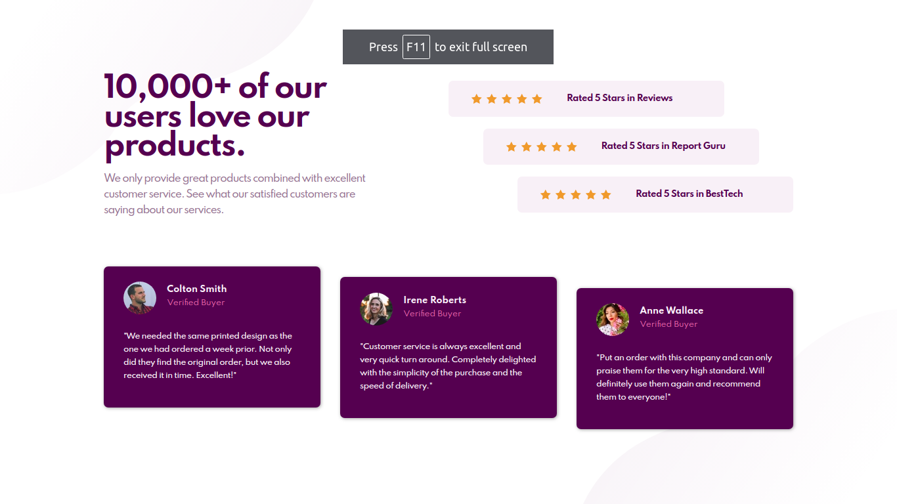

# Frontend Mentor - Social Proof Section 

All code and implementation is of my own, only the design and assests are supplied by [Frontend Mentor](https://www.frontendmentor.io/challenges/social-proof-section-6e0qTv_bA) challenge.

A blurp, review and testimonial section to demonstrate CSS Flexbox usage within a Grid.

The mobile responsive social proof section is written in vanilla HTML and CSS using Grid and Flexbox as major CSS components.

[View](https://social-proof-section-pi-five.vercel.app/) the componant!

